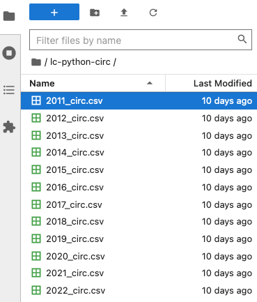

::::::::::::::::::::::::::::::::::::::: objectives

- Learners can launch JupyterLab and create a Jupyter Notebook.
- Learners are able to navigate the JupyterLab interface.
- Learners are able to write and run Python cells in a notebook.
- Learners are able to save their code as an iPython notebook (.ipynb file).

::::::::::::::::::::::::::::::::::::::::::::::::::

:::::::::::::::::::::::::::::::::::::::: questions

- How do I use JupyterLab?
- How can I run Python code in JupyterLab?

::::::::::::::::::::::::::::::::::::::::::::::::::

## Use JupyterLab to edit and run Python code.
  
If you haven't already done so, see [the setup instructions](../learners/setup.md) for details on how to install JupyterLab and Python via Anaconda. The setup instructions also walk you through the steps you should follow to create an `lc-python` folder on your Desktop, and to download and unzip the dataset we'll be working with inside of that directory. 

### Getting started with JupyterLab
To run Python, we are going to use Jupyter Notebooks via [JupyterLab][jupyterlab]. Jupyter notebooks are common in data science and visualization and serve as a convenient environment for running Python code interactively where we can view and share the results of our Python code.

There are other ways of editing, managing, and running Python code. Software developers often use an integrated development environment (IDE) like [PyCharm](https://www.jetbrains.com/pycharm/), [Spyder][spyder] or [Visual Studio Code](https://code.visualstudio.com/), or text editors like Vim or Emacs, to create and edit Python scripts. After editing and saving Python scripts you can execute those programs within the IDE itself or directly on the command line. In contrast, Jupyter notebooks let us execute and view the results of our Python code immediately within the notebook.

JupyterLab has several other handy features:

- You can easily type, edit, and copy and paste blocks of code.
- Tab complete allows you to easily access the names of things you are using
  and learn more about them.
- It allows you to annotate your code with links, different sized text, bullets, etc.
  to make it more accessible to you and your collaborators.
- It allows you to display figures next to the code that produces them
  to tell a complete story of the analysis.

Each notebook contains one or more cells that contain code, text, or images.

### Start JupyterLab
Once you have created the `lc-python` directory on your Desktop, you can start JupyterLab by opening a shell command line interface or by using Anaconda Navigator.

#### Mac users - Command Line

1. In your `Applications` folder, open `Utilities` and double-click on `Terminal`.
2. After you have launched Terminal, change directories to the `lc-python` folder you created earlier and type `jupyter lab`:

```bash
$ cd ../Desktop/lc-python
$ jupyter lab
```

#### Windows users - Command Line

To start the JupyterLab server you will need to access the Anaconda Prompt.

1. Press the <kbd>Windows Logo Key</kbd> and search for `Anaconda Prompt`, click the result or press enter.

2. Once you have launched the Anaconda Prompt, type the command:

```bash
$ jupyter lab
```

#### Start JupyterLab from Anaconda Navigator
If you are unfamiliar with the command line,  you can launch JupyterLab by opening the Anaconda Navigator app and choosing the `Launch` button underneath the JuypterLab icon. 

First [start Anaconda Navigator (click for detailed instructions on macOS, Windows, and Linux)](https://docs.anaconda.com/free/navigator/getting-started/#navigator-starting-navigator). You can search for Anaconda Navigator via Spotlight on macOS (<kbd>Command</kbd> + <kbd>spacebar</kbd>), or by using the Windows search function (<kbd>Windows Logo Key</kbd>).

After you have launched Anaconda Navigator, click the `Launch` button under JupyterLab. You may need to scroll down to find it. Here is a screenshot of an Anaconda Navigator page similar to the one that should open on either macOS or Windows.

{alt='screenshot of the launch button for JuypterLab in Anaconda Navigator'}

## The JupyterLab Interface

Launching JupyterLab opens a new tab or window in your preferred web browser. While JupyterLab enables you to run code from your browser, it does not require you to be online. If you take a look at the URL in your browser address bar, you should see that the environment is located at your localhost, meaning it is running from your computer: `http://localhost:8888/lab`.

When you first open JupyterLab you will see two main panels. In the left sidebar is your file browser. You should see a folder in the file browser named `lc-python-circ` that contains all of our data. 

### Creating a Juypter Notebook

To the right you will see a `Launcher` tab. Here we have options to launch a Python 3 notebook, a Terminal (where we can use shell commands), text files, and other items. For now, we want to launch a new Python 3 notebook, so click once on the `Python 3 (ipykernel)` button underneath the Notebook header. You can also create a new notebook by selecting *New -> Notebook* from the *File* menu in the Menu Bar.

{alt='screenshot of the JupyterLab for launching notebook'}

When you start a new Notebook you should see a new tab labeled `Untitled.ipynb`. You will also see this file listed in the file browser to the left. Right-click on the `Untitled.ipynb` file in the file browser and choose `Rename` from the dropdown options. Let's call the notebook file, `workshop.ipynb`.

From the file browser in the left sidebar you can also select the `lc-python-circ` folder to view the contents of the folder. If you downloaded and uncompressed the dataset correctly, you should see a series of CSV files from 2011 to 2022. If you double-click on the first file, `2011_circ.csv`, you will see a preview of the CSV file in a new tab in the main panel of JupyterLab. This is a helpful way to take a peek at the data before loading it into Python.

{alt='screenshot of the file browser JuypterLab'}

:::::::::::::::::::::::::::::::::::::::::  callout

## JupyterLab? What about Jupyter notebooks? Python notebooks? IPython?

JupyterLab is the [next stage in the evolution of the Jupyter Notebook](https://jupyterlab.readthedocs.io/en/stable/getting_started/overview.html#overview).
If you have prior experience working with Jupyter notebooks, then you will have a good idea of how to work with JupyterLab. Jupyter was created as a spinoff of IPython in 2014, and includes interactive computing support for languages other than just Python, including R and Julia. While you'll still see some references to Python and IPython notebooks, IPython notebooks are officially deprecated in favor of Jupyter notebooks.

::::::::::::::::::::::::::::::::::::::::::::::::::

We will share more features of the JupyterLab environment as we advance through the lesson, but for now let's turn to how to run Python code.

### Running Python code 

Jupyter allows you to add code and formatted text in different types of blocks, called cells. By default, each new cell in a Jupyter Notebook will be a "code cell" that allows you to input and run Python code. Let's start by having Python do some arithmetic for us. 

In the first cell type in 7 * 3, and then press the <kbd>Shift</kbd>\+<kbd>Return</kbd> keys together to execute the contents of the cell. (You can also run a cell by making sure your cursor is in the cell and choosing `Run > Run Selected Cells` or selecting the "Play" icon (the sideways triangle) at the top of the noteboook.)

```python
7 * 3
```

You should see the output appear immediately below the cell, and Jupyter will also create a new code cell for you. 

```python
21
```

If you move your cursor back to the first cell, just after the `7 * 3` code, and hit the kbd>Return</kbd> key (without shift), you should see a new line in the cell where you can add more Python code. Let's add another calculation to the same cell:

```python
7 * 3
2 +1
```

While Python runs both calculations Juypter will only display the output from the last line of code in a specific cell, unless you tell it to do otherwise.

```python
3
```

:::::::::::::::::::::::::::::::::::::::::  callout
### Editing the notebook

- If you press <kbd>Esc</kbd> and <kbd>Return</kbd> alternately, the outer border of your code cell will change from gray to blue.
- These are the **Command** (gray) and **Edit** (blue) modes of your notebook.
- When in Command mode (esc/gray),
  - The <kbd>b</kbd> key will make a new cell below the currently selected cell.
  - The <kbd>a</kbd> key will make one above.
  - The <kbd>x</kbd> key will delete the current cell.
  - The <kbd>z</kbd> key will undo your last cell operation (which could be a deletion, creation, etc).
  
You can also use the icons above the notebook to make a few of the same cell operations:
- The `+` icon adds a new cell below the selected cell.
- The scissors icon will delete the current cell. 

You can move cells around in your notebook by going to Command mode, hovering over the left-hand margin of a cell until your cursor changes into a four-pointed arrow, and then dragging and dropping the cell where you want it.

::::::::::::::::::::::::::::::::::::::::::::::::::

### Markdown
You can also add text to a Juypter notebook by selecting a cell, and changing the dropdown above the notebook from `Code` to `Markdown`. Markdown is a lightweight language for formatting text. This feature allows you to annotate your code, add headers, and write documentation to help explain the code.  

{alt='screenshot of the Jupyter notebook dropdown to change a cell to Markdown'}

:::::::::::::::::::::::::::::::::::::::  challenge
Markdown uses the hash symbol, `#`, at the beginning of a line to mark a header and a hyphen, `-`, to mark an un-ordered list item (e.g., a bullet point). For example:

```markdown
# This is a Header 1
## This is a Header 2
### This is a Header 3
This is unformatted text. 
- Here's the first bullet. 
- Here's the second bullet. 
```

Add a new cell to the beginning of your notebook with a header and bullet points to introduce the workshop file. You might add your name, date, or other features that explain that the code that follows is for a Library Carpentry Intro to Python workshop. 

:::::::::::::::  solution

## Solution


```markdown
# Library Carpentry - Python workshop
- Date: October 9, 2023
- Author: Cody Hennesy
This Jupyter notebook contains code from the Library Carpentry lesson, Intro to Python.

```

:::::::::::::::::::::::::

::::::::::::::::::::::::::::::::::::::::::::::::::


## Saving the code

Changes you make to your notebook will periodically save automatically, but you can also 
use <kbd>Cmd</kbd> + <kbd>S</kbd> to save your notebook at any time. You can also explore options to save the notebook to a new file or export it to other formats (including HTML, LaTeX, and Markdown) from the `File >` dropdown menu.

[anaconda]: https://docs.anaconda.com/anaconda/install/
[spyder]: https://www.spyder-ide.org/
[jupyterlab]: https://jupyterlab.readthedocs.io/en/stable/


:::::::::::::::::::::::::::::::::::::::: keypoints

- You can launch JupyterLab from the command line or from Anaconda Navigator.
- You can use a JupyterLab notebook to edit and run Python.
- Notebooks can include both code and markdown cells.

::::::::::::::::::::::::::::::::::::::::::::::::::


