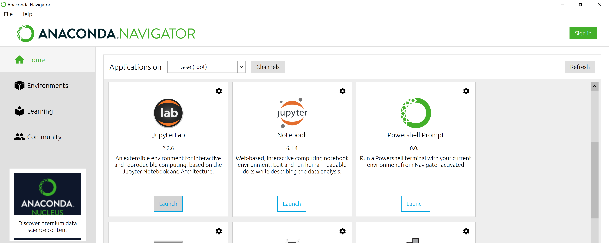

::::::::::::::::::::::::::::::::::::::: objectives

- Learners can launch JupyterLab and create a Jupyter Notebook.
- Learners are able to navigate the JupyterLab interface
- Learners are able to write and run Python cells in a notebook
- Learners are able to save their code as an iPython notebook (.ipynb file) 

::::::::::::::::::::::::::::::::::::::::::::::::::

:::::::::::::::::::::::::::::::::::::::: questions

- How do I use JupyterLab?
- How can I run Python code in JupyterLab?

::::::::::::::::::::::::::::::::::::::::::::::::::

## Use JupyterLab to edit and run Python code.
  
If you haven't already done so, see [the setup instructions](../learners/setup.md) for details on how to install JupyterLab and Python via Anaconda. The setup instructions also walk you through the steps you should follow to create an `lc-python` folder on your Desktop, and to download and unzip the dataset we'll be working with inside of that directory. 

## Getting started with JupyterLab
To run Python, we are going to use Jupyter Notebooks via [JupyterLab][jupyterlab]. Jupyter notebooks are common in data science and visualization and serve as a convenient environment for running Python code interactively where we can view and share the results of our Python code.

There are other ways of editing, managing, and running Python code. Software developers often use an integrated development environment (IDE) like [PyCharm](https://www.jetbrains.com/pycharm/), [Spyder][spyder] or [Visual Studio Code](https://code.visualstudio.com/), or text editors like Vim or Emacs, to create and edit Python scripts. After editing and saving Python scripts you can execute those programs within the IDE itself or directly on the command line. In contrast, Jupyter notebooks let us execute and view the results of our Python code immediately within the notebook.

JupyterLab has several other handy features:

- You can easily type, edit, and copy and paste blocks of code.
- Tab complete allows you to easily access the names of things you are using
  and learn more about them.
- It allows you to annotate your code with links, different sized text, bullets, etc.
  to make it more accessible to you and your collaborators.
- It allows you to display figures next to the code that produces them
  to tell a complete story of the analysis.

Each notebook contains one or more cells that contain code, text, or images.

## Start JupyterLab
Once you have created the `lc-python` directory on your Desktop, you can start JupyterLab by opening a shell command line interface or by using Anaconda Navigator.

### Mac users - Command Line

1. In your`Applications` folder, open `Utilities` and double-click on `Terminal`.
2. After you have launched Terminal, change directories to the `lc-python` folder you created earlier and type `jupyter lab`:

```bash
$ cd ../Desktop/lc-python
$ jupyter lab
```

### Windows users - Command Line

To start the JupyterLab server you will need to access the Anaconda Prompt.

1. Press the <kbd>Windows Logo Key</kbd> and search for `Anaconda Prompt`, click the result or press enter.

2. Once you have launched the Anaconda Prompt, type the command:

```bash
$ jupyter lab
```

### Start JupyterLab from Anaconda Navigator
If you are unfamiliar with the command line,  you can also launch JupyterLab by opening the Anaconda Navigator app and choosing the `Launch` button underneath the JuypterLab icon. 

First [start Anaconda Navigator (click for detailed instructions on macOS, Windows, and Linux)](https://docs.anaconda.com/free/navigator/getting-started/#navigator-starting-navigator). You can search for Anaconda Navigator via Spotlight on macOS (<kbd>Command</kbd> + <kbd>spacebar</kbd>), or by using the Windows search function (<kbd>Windows Logo Key</kbd>).

After you have launched Anaconda Navigator, click the `Launch` button under JupyterLab. You may need to scroll down to find it.

Here is a screenshot of an Anaconda Navigator page similar to the one that should open on either macOS or Windows.

{alt='screenshot of the launch button for JuypterLab in Anaconda Navigator'}

### The JupyterLab Interface

Launching JupyterLab opens a new tab or window in your preferred web browser. While JupyterLab enables you to run code from your browser, it does not require you to be online. If you take a look at the URL in your browser address bar, you should see that the environment is located at your localhost, meaning it is running from your computer: `http://localhost:8888/lab`.

When you first open JupyterLab you will see two main panels. In the left sidebar is your file browser. You should see a folder in the file browser named `lc-python-circ` that contains all of our data. If you double-click on that folder, you will see a list of the CSV files we'll be working with. To get back to the working directory, choose the folder icon just above file browser pane. 

To the right you will initially see a Launcher tab. Here we have options to launch a Python 3 notebook, a Terminal (where we can use shell commands), text files, and other items. For now, we want to launch a new Python 3 notebook, so click once on the `Python 3 (ipykernel)` button underneath the Notebook header. 

{alt='screenshot of the JupyterLab for launching notebook'}

When you start a new Notebook you should see a new tab labeled `Untitled.ipynb`. You will also see this file listed in the file browser to the left. Right-click on the `Untitled.ipynb` file in the file browser and choose `Rename` from the dropdown options. Let's call the notebook file, `workshop.ipynb`.

### Running Python code 


## Python in the console

:::::::::::::::::::::::::::::::::::::::  challenge

Go to the IPython tab at the bottom right. What happens when you type a small calculation there?
For example, what happens when you type the following calculation and press enter?

```python
7 * 3
```

:::::::::::::::  solution

## Solution

Python returns the result of the calculation.

```python
21
```

:::::::::::::::::::::::::

::::::::::::::::::::::::::::::::::::::::::::::::::

:::::::::::::::::::::::::::::::::::::::  challenge

## Python in the editor

The large panel on the left probably has some text in it that looks like this:

```
"""
Spyder Editor

This is a temporary script file.
"""
```

Write the following line below these lines and press run (the green 'play' button or f5). A window might pop up asking you to specify the run settings, leave the settings as they are and press 'Run'.
What happens?

```python
print('Hello world!')
```

:::::::::::::::  solution

## Solution

In the IPython console  Python tells you which files it ran and the result of this run

```python
runfile('/home/ylja/.config/spyder-py3/temp.py', wdir='/home/ylja/.config/spyder-py3')
Hello world!
```

:::::::::::::::::::::::::

::::::::::::::::::::::::::::::::::::::::::::::::::

- Code written in the editor can be saved, like any other file.

:::::::::::::::::::::::::::::::::::::::  challenge

## Saving the code

To save the code, press 'file' and then 'save as'. Now give the file a name, for example 'mycode.py' and save it in a directory/folder where you know how to find it.
Look into your file system the way you usually do it. Is the file where you expect it to be?

::::::::::::::::::::::::::::::::::::::::::::::::::

[anaconda]: https://docs.anaconda.com/anaconda/install/
[spyder]: https://www.spyder-ide.org/
[jupyterlab]: https://jupyterlab.readthedocs.io/en/stable/


:::::::::::::::::::::::::::::::::::::::: keypoints

- Use the Spyder IDE for editing and running Python
- The IPython console can be used to interact with Python directly
- The editor can be used to write code, run and save it

::::::::::::::::::::::::::::::::::::::::::::::::::


