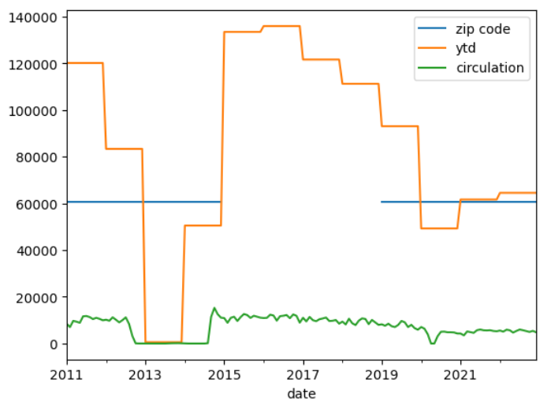
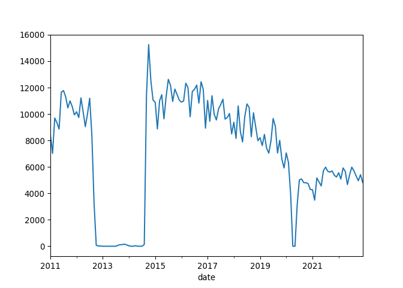
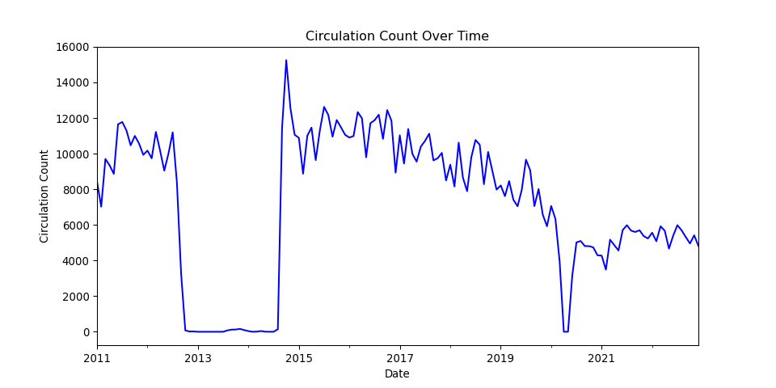
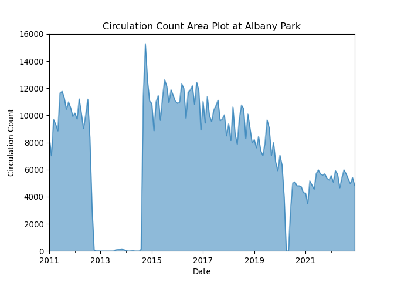
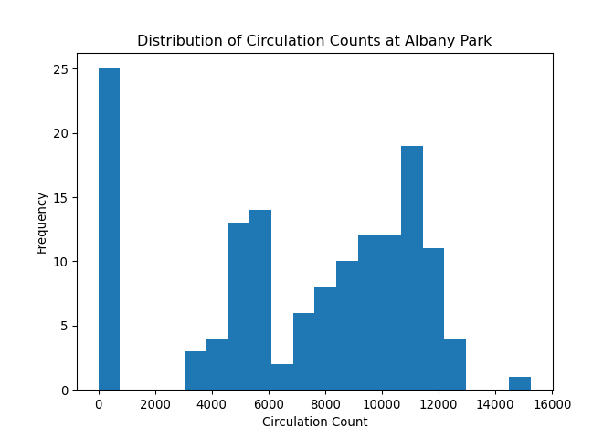
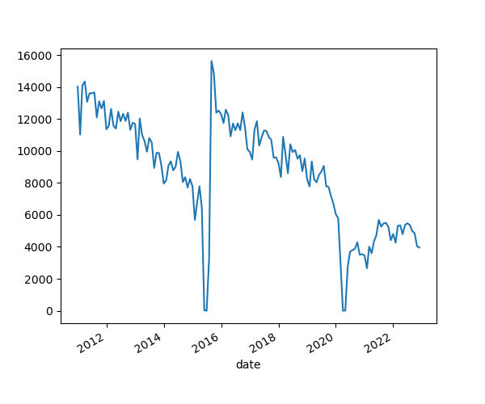
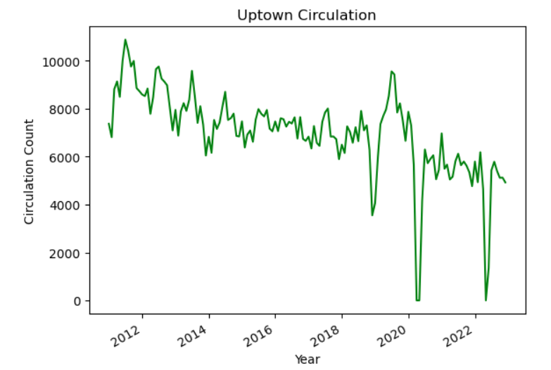
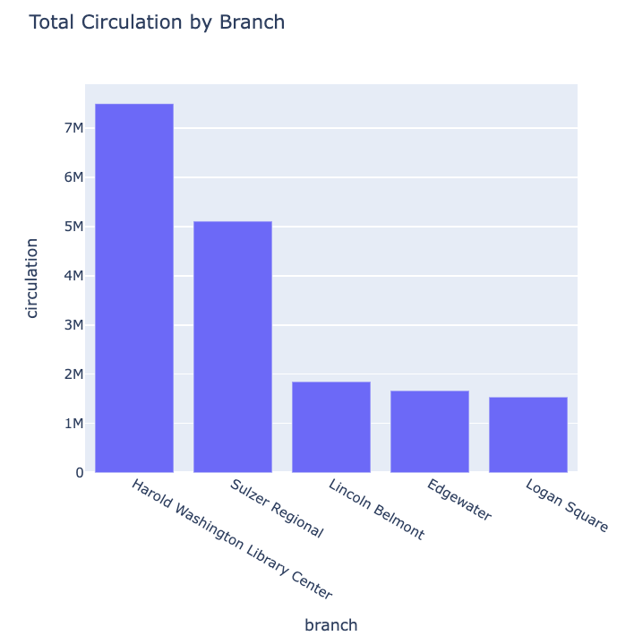

:::::::::::::::::::::::::::::::::::::: questions 

- How can I use Python tools like Pandas and Plotly to visualize library circulation data?

::::::::::::::::::::::::::::::::::::::::::::::::

::::::::::::::::::::::::::::::::::::: objectives

- Generate plots using Python to interpret and present data on library circulation.
- Apply data manipulation techniques with pandas to prepare and transform library circulation data into a suitable format for visualization.
- Analyze and interpret time-series data by identifying key trends and outliers in library circulation data.

::::::::::::::::::::::::::::::::::::::::::::::::

For this module, we will use the tidy (long) version of our circulation data, where each variable forms a column, each observation forms a row, and each type of observation unit forms a row. If your workshop included the Tidy Data episode, you should be set and have an object called `df_long` in your Jupyter environment. If not, we’ll read that dataset in now, as it was provided for this lesson.


``` python
#import if it is already not
import pandas as pd
df_long = pd.read_pickle('data/df_long.pkl')
```

Let’s look at the data:

``` python
df_long.head()
```

|            | branch         | address                 | city    | zip code | ytd    | year | month   | circulation |
|------------|----------------|-------------------------|---------|----------|--------|------|---------|-------------|
| date       |                |                         |         |          |        |      |         |             |
| 2011-01-01 | Albany Park    | 5150 N. Kimball Ave.    | Chicago | 60625.0  | 120059 | 2011 | january | 8427        |
| 2011-01-01 | Altgeld        | 13281 S. Corliss Ave.   | Chicago | 60827.0  | 9611   | 2011 | january | 1258        |
| 2011-01-01 | Archer Heights | 5055 S. Archer Ave.     | Chicago | 60632.0  | 101951 | 2011 | january | 8104        |
| 2011-01-01 | Austin         | 5615 W. Race Ave.       | Chicago | 60644.0  | 25527  | 2011 | january | 1755        |
| 2011-01-01 | Austin-Irving  | 6100 W. Irving Park Rd. | Chicago | 60634.0  | 165634 | 2011 | january | 12593       |


## Plotting with Pandas 

Ok! We are now ready to plot our data. Since this data is monthly data, we can plot the circulation data over time.

At first, let’s focus on a specific branch. We can select the rows for the Albany Park branch:

``` python
albany = df_long[df_long['branch'] == 'Albany Park']
```

``` python
albany.head()
```

|            | branch      | address              | city    | zip code | ytd    | year | month   | circulation |
|------------|-------------|----------------------|---------|----------|--------|------|---------|-------------|
| date       |             |                      |         |          |        |      |         |             |
| 2011-01-01 | Albany Park | 5150 N. Kimball Ave. | Chicago | 60625.0  | 120059 | 2011 | january | 8427        |
| 2012-01-01 | Albany Park | 5150 N. Kimball Ave. | Chicago | 60625.0  | 83297  | 2012 | january | 10173       |
| 2013-01-01 | Albany Park | 5150 N. Kimball Ave. | Chicago | 60625.0  | 572    | 2013 | january | 0           |
| 2014-01-01 | Albany Park | 5150 N. Kimball Ave. | Chicago | 60625.0  | 50484  | 2014 | january | 35          |
| 2015-01-01 | Albany Park | NaN                  | NaN     | NaN      | 133366 | 2015 | january | 10889       |

Now we can use the `plot()` function that is built in to pandas. Let’s try it:

``` python
albany.plot()
```

{alt="Line plot of zip code, ytd, year, and circulation numbers over time from the albany DataFrame"}

That's interesting, but by default `.plot()` will use a line plot for all numeric variables of the DataFrame. This isn’t exactly what we want, so let’s tell `.plot()` what variable to use by selecting the `circulation` column.


``` python
albany['circulation'].plot()
```

{alt="Line plot of the Albany Park branch circulation showing a big drop from 2013 to 2014."}

::::::::::::::::::::::::::::::::::::::::::::::::::::::::::::: challenge

## Analyze the Circulation Trends

Examine the line graph depicting library circulation data. You will notice two significant periods where the circulation drops to zero: first in March 2020 and then a two-year zero circulation period starting in 2012. Evaluate the graph and identify any trends, unusual patterns, or notable changes in the data.

::::::::::::::::::::::::::::::::::::::::::::::::::: solution

The significant drop in circulation in March 2020 is likely due to the COVID-19 pandemic, which caused widespread temporary closures of public spaces, including libraries. 

The drop from 2012 through part of 2014 corresponds to the reconstruction period of the Albany Park Branch. The original building at 5150 N. Kimball Avenue was demolished in 2012, and a new, modern building was constructed at the same site. The new Albany Park Branch opened on September 13, 2014, at 3104 W. Foster Avenue in the North Park neighborhood of Chicago. More details about this renovation can be found on the Chicago Public Library webpage: [Chicago Public Library - Albany Park](https://www.chipublib.org/news/stories-we-tell-albany-park-exhibit/).
::::::::::::::::::::::::::::::::::::::::::::::::
::::::::::::::::::::::::::::::::::::::::::::::::

## Use Pandas for More Detailed Charts

What if we want to alter the axis labels and the title of the graph? Pandas' built-in plotting functions, which are backended by Matplotlib, allow us to customize various aspects of a plot without needing to import Matplotlib directly.

- We can pass parameters to Pandas' `.plot()` function to add a plot title, specify a figure size, and change the color of the line.
- Additionally, we can directly set the x and y axis labels within the `.plot()` function.

``` python
albany['circulation'].plot(title='Circulation Count Over Time', 
                                figsize=(10, 5), 
                                color='blue', 
                                xlabel='Date',
                                ylabel='Circulation Count')
```

{alt="Line plot of the Albany Park branch circulation with matplotlib styles applied."}

### Changing plot types

What if we want to use a different plot type for this graphic? To do so, we can change the `kind` parameters in our `.plot()` function.

``` python
albany['circulation'].plot(kind='area', 
                            title='Circulation Count Area Plot at Albany Park', alpha=0.5, 
                            xlabel='Date',
                            ylabel='Circulation Count')
```

{alt="Area plot of the Albany Park branch circulation."}

We can also look at our circulation data as a histogram.

``` python
albany['circulation'].plot(kind='hist', bins=20, 
                            title='Distribution of Circulation Counts at Albany Park',
                            xlabel='Circulation Count')
```

{alt="histogram of the Albany branch circulation."}

## Use Plotly for interactive plots 

Let’s switch back to the full DataFrame in `df_long` and use another
plotting package in Python called Plotly. First let’s install and then use the package.

```python
# uncomment below to install plotly if the import fails. 
# !pip install plotly
import plotly.express as px
```

Now we can visualize how circulation counts have changed over time for selected branches. This can be especially useful for identifying trends, seasonality, or data anomalies. We willfirst create a subset of our data to look at branches starting with the letter 'A'. Feel free to select different branches. After subsetting, we will sort our new DataFrame by date and then plot our data by date and circulation count.

``` python
# Creating a line plot for a few selected branches to avoid clutter
selected_branches = df_long[df_long['branch'].isin(['Altgeld',
 'Archer Heights',
 'Austin',
 'Austin-Irving',
 'Avalon'])]
selected_branches = selected_branches.sort_values(by='date')
```

``` python
fig = px.line(selected_branches, x=selected_branches.index, y='circulation', color='branch', title='Circulation Over Time for Selected Branches')
fig.show()
```

Here is a view of the [interactive output of the Plotly line chart](learners/line_plot_int.html).  


One advantage that Plotly provides over Matplotlib is that it has some interactive features out of the box. Hover your cursor over the lines in the output to find out more granular data about specific branches over time.


### Bar plots with Plotly

Let’s use a barplot to compare the distribution of circulation counts
among branches. We first need to group our data by branch and sum up the circulation counts. Then we can use the bar plot to show the
distribution of total circulation over branches.

``` python
# Aggregate circulation by branch
total_circulation_by_branch = df_long.groupby('branch')['circulation'].sum().reset_index()

# Create a bar plot
fig = px.bar(total_circulation_by_branch, x='branch', y='circulation', title='Total Circulation by Branch')
fig.show()
```

Here is a view of the [interactive output of the Plotly bar chart](learners/bar_plot_int.html).  

:::::::::::::::::::::::::::::::::::::::  challenge

## Plotting with Pandas

1. Load the dataset `df_long.pkl` using Pandas.
2. Create a new DataFrame that only includes the data for the "Chinatown" branch.
3. Use the Pandas plotting function to plot the "circulation" column over time.


:::::::::::::::  solution

## Solution

```python
import pandas as pd
df_long = pd.read_pickle('data/df_long.pkl')
chinatown = df_long[df_long['branch'] == 'Chinatown']
chinatown['circulation'].plot()
```

{alt='image showing the circulation of the Chinatown branch over ten years'}

:::::::::::::::::::::::::

::::::::::::::::::::::::::::::::::::::::::::::::::

:::::::::::::::::::::::::::::::::::::::  challenge

## Modify a plot display

Add a line to the code below to plot the Uptown branch circulation including the following plot elements:

- A title, "Uptown Circulation"
- "Year" and "Circulation Count" labels for the x and y axes
- A green plot line


```python
import pandas as pd
df_long = pd.read_pickle('data/df_long.pkl')
uptown = df_long[df_long['branch'] == 'Uptown']
```

:::::::::::::::  solution

## Solution

```python
uptown['circulation'].plot(title='Uptown Circulation', 
                                color='green', 
                                xlabel='Year',
                                ylabel='Circulation Count')
```

{alt='image showing the circulation of the Uptown branch with labels'}

:::::::::::::::::::::::::

::::::::::::::::::::::::::::::::::::::::::::::::::

:::::::::::::::::::::::::::::::::::::::  challenge

## Plot the top five branches

Modify the code below to only plot the five Chicago Public Library branches with the highest circulation. 


```python
import plotly.express as px
import pandas as pd
df_long = pd.read_pickle('data/df_long.pkl')
total_circulation_by_branch = df_long.groupby('branch')['circulation'].sum().reset_index()

top_five = total_circulation_by_branch.___________________

# Create a bar plot
fig = px.bar(top_five._______, x='branch', y='circulation', width=600, height=600, title='Total Circulation by Branch')
fig.show()
```

:::::::::::::::  solution

## Solution

```python
total_circulation_by_branch.sort_values(by='circulation', ascending=False)
df_long = pd.read_pickle('data/df_long.pkl')
total_circulation_by_branch = df_long.groupby('branch')['circulation'].sum().reset_index()

top_five = total_circulation_by_branch.sort_values(by='circulation', ascending=False)

# Create a bar plot
fig = px.bar(top_five.head(), x='branch', y='circulation', width=600, height=600, title='Total Circulation by Branch')
fig.show()

```

{alt='a bar plot of the top five branch circulation figures'}

:::::::::::::::::::::::::

::::::::::::::::::::::::::::::::::::::::::::::::::


::: keypoints
-   Explored the use of pandas for basic data manipulation, ensuring correct indexing with DatetimeIndex to enable time-series operations like resampling.
-   Used pandas’ built-in plot() for initial visualizations and faced issues with overplotting, leading to adjustments like data filtering and resampling to simplify plots.
-   Introduced Plotly for advanced interactive visualizations, enhancing user engagement through dynamic plots such as line graphs, area charts, and bar plots with capabilities like dropdown selections.
:::
