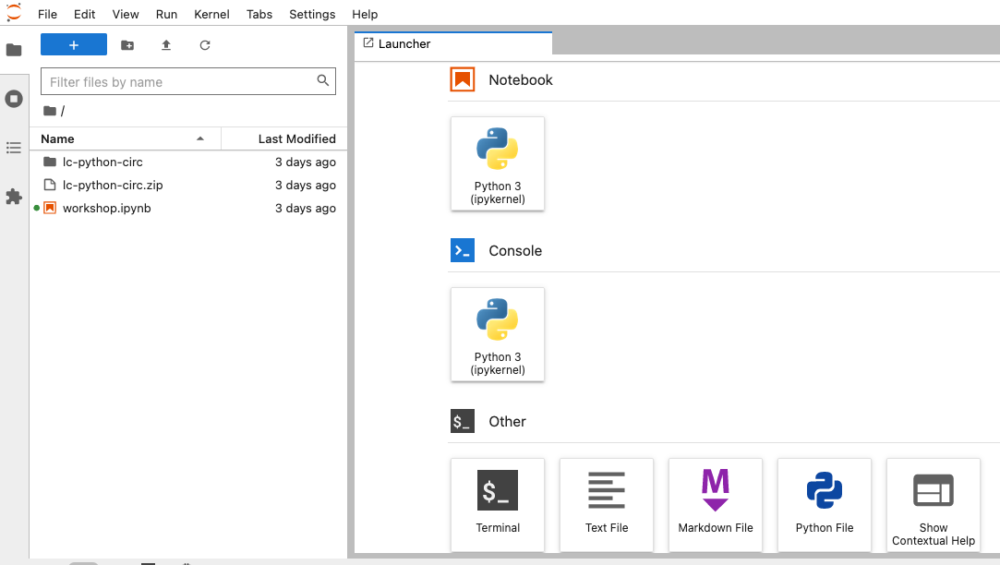

::::::::::::::::::::::::::::::::::::::: objectives

- Learners are aware of applications for Python in library and information-science work environments.
- Learners can launch JupyterLab and create a Jupyter Notebook.
- Learners are able to navigate the JupyterLab interface.
- Learners are able to write and run Python cells in a notebook.
- Learners are able to save their code as an iPython notebook (.ipynb file).

::::::::::::::::::::::::::::::::::::::::::::::::::

:::::::::::::::::::::::::::::::::::::::: questions

- How do I use JupyterLab?
- How can I run Python code in JupyterLab?

::::::::::::::::::::::::::::::::::::::::::::::::::

## Why Python?

Python is a popular programming language for tasks such as data collection, cleaning, and analysis. Python can help you to create reproducible workflows to accomplish repetitive tasks more efficiently. 

This lesson works with a series of CSV files of circulation data from the Chicago Public Library system to demonstrate how to use Python to clean, analyze, and visualize usage data that spans over the course of multiple years. 

:::::::::::::::::::::::::::::::::::::::  challenge
## Python in Libraries
There are a lot of ways that library and information science folks use Python in their work. Go around the room and have helpers and co-teachers share how they have used Python.

Learners: Can you think of other ways to use Python in libraries? Do you have hopes for how you'd like to use Python in the future?

:::::::::::::::  solution

Here a few areas where you might apply Python in your work.

**Metadata work.** Many cataloging teams use Python to migrate, transform and enrich metadata that they receive from different sources. For example, the [pymarc library](https://pypi.org/project/pymarc/) is a popular Python package for working with MARC21 records.

**Collection and citation analysis.** Python can automate workflows to analyze library collections. In cases where spreadsheets and OpenRefine are unable to support specific forms of analysis, Python is a more flexible and powerful tool.

**Assessment.** Library workers often need to collect metrics or statistics on some aspect of their work. Python can be a valuable tool to collect, clean, analyze, and visualize that data in a consistent way over time.

**Accessing data.** Researchers often use Python to collect data (including textual data) from websites and social media platforms. Academic librarians are often well-positioned to help teach these researchers how to use Python for web scraping or querying Application Programming Interfaces (APIs) to access the data they need. 

**Analyzing data.** Python is widely used by scholars who are embarking on different forms of computational research (e.g., network analysis, natural language processing, machine learning). Library workers can leverage Python for their own research in these areas, but also take part in larger networks of academic support related to data science, computational social sciences, and/or digital humanities.
:::::::::::::::::::::::::
::::::::::::::::::::::::::::::::::::::::::::::::::

## Use JupyterLab to edit and run Python code.
  
If you haven't already done so, see [the setup instructions](../learners/setup.md) for details on how to install JupyterLab and Python via Anaconda. The setup instructions also walk you through the steps you should follow to create an `lc-python` folder on your Desktop, and to download and unzip the dataset we'll be working with inside of that directory. 

### Getting started with JupyterLab
To run Python, we are going to use Jupyter Notebooks via [JupyterLab][jupyterlab]. Jupyter notebooks are common tools for data science and visualization, and serve as a convenient environment for running Python code interactively where we can view and share the results of our Python code.

:::::::::::::::::::::::::::::::::::::::::  callout
### Alternatives to Juypter
There are other ways of editing, managing, and running Python code. Software developers often use an integrated development environment (IDE) like [PyCharm](https://www.jetbrains.com/pycharm/), [Spyder][spyder] or [Visual Studio Code (VS Code)](https://code.visualstudio.com/), to create and edit Python scripts. Others use text editors like Vim or Emacs to hand-code Python. After editing and saving Python scripts you can execute those programs within an IDE or directly on the command line. 
::::::::::::::::::::::::::::::::::::::::::::::::::

Jupyter notebooks let us execute and view the results of our Python code immediately within the notebook. JupyterLab has several other handy features:

- You can easily type, edit, and copy and paste blocks of code.
- It allows you to annotate your code with links, different sized text, bullets, etc.
  to make it more accessible to you and your collaborators.
- It allows you to display figures next to the code 
  to better explore your data and visualize the results of your analysis.
- Each notebook contains one or more cells that contain code, text, or images.

### Start JupyterLab
Once you have created the `lc-python` directory on your Desktop, you can start JupyterLab by opening a shell command line interface or by using Anaconda Navigator.

#### Mac users - Command Line

1. Press the <kbd>cmd</kbd> + <kbd>spacebar</kbd> keys and search for `Terminal`. Click the result or press <kbd>return</kbd>. (You can also find `Terminal` in your `Applications` folder, under `Utilities`.)
2. After you have launched Terminal, change directories to the `lc-python` folder you created earlier and type `jupyter lab`. Note that the `$` sign is used to indicate a command to be typed on the command prompt, but we never type the `$` sign itself, just what follows after it.

```bash
$ cd ../Desktop/lc-python
$ jupyter lab
```

#### Windows users - Command Line

To start the JupyterLab server you will need to access the Anaconda Prompt.

1. Press the <kbd>Windows Logo Key</kbd> and search for `Anaconda Prompt`, click the result or press enter.

2. Once you have launched the Anaconda Prompt, type the command `jupyter lab`. Note that the `$` sign is used to indicate a command to be typed on the command prompt, but we never type the `$` sign itself, just what follows after it.

```bash
$ jupyter lab
```

#### Start JupyterLab from Anaconda Navigator
If you are unfamiliar with the command line,  you can launch JupyterLab by opening the Anaconda Navigator app and choosing the `Launch` button underneath the JuypterLab icon. 

First [start Anaconda Navigator (click for detailed instructions on macOS, Windows, and Linux)](https://docs.anaconda.com/free/navigator/getting-started/#navigator-starting-navigator). You can search for Anaconda Navigator via Spotlight on macOS (<kbd>Command</kbd> + <kbd>spacebar</kbd>), or by using the Windows search function (<kbd>Windows Logo Key</kbd>).

After you have launched Anaconda Navigator, click the `Launch` button under JupyterLab. You may need to scroll down to find it. Here is a screenshot of an Anaconda Navigator page similar to the one that should open on either macOS or Windows.

{alt='screenshot of the launch button for JuypterLab in Anaconda Navigator'}

## The JupyterLab Interface

Launching JupyterLab opens a new tab or window in your preferred web browser. While JupyterLab enables you to run code from your browser, it does not require you to be online. If you take a look at the URL in your browser address bar, you should see that the environment is located at your localhost, meaning it is running from your computer: `http://localhost:8888/lab`.

When you first open JupyterLab you will see two main panels. In the left sidebar is your file browser. You should see a folder in the file browser named `data` that contains all of our data. 

### Creating a Juypter Notebook

To the right you will see a `Launcher` tab. Here we have options to launch a Python 3 notebook, a Terminal (where we can use shell commands), text files, and other items. For now, we want to launch a new Python 3 notebook, so click once on the `Python 3 (ipykernel)` button underneath the Notebook header. You can also create a new notebook by selecting *New -> Notebook* from the *File* menu in the Menu Bar.

{alt='screenshot of the JupyterLab for launching notebook'}

When you start a new Notebook you should see a new tab labeled `Untitled.ipynb`. You will also see this file listed in the file browser to the left. Right-click on the `Untitled.ipynb` file in the file browser and choose `Rename` from the dropdown options. Let's call the notebook file, `workshop.ipynb`.


:::::::::::::::::::::::::::::::::::::::::  callout

## JupyterLab? What about Jupyter notebooks? Python notebooks? IPython?

JupyterLab is the [next stage in the evolution of the Jupyter Notebook](https://jupyterlab.readthedocs.io/en/stable/getting_started/overview.html#overview).
If you have prior experience working with Jupyter notebooks, then you will have a good idea of how to work with JupyterLab. Jupyter was created as a spinoff of IPython in 2014, and includes interactive computing support for languages other than just Python, including R and Julia. While you'll still see some references to Python and IPython notebooks, IPython notebooks are officially deprecated in favor of Jupyter notebooks.

::::::::::::::::::::::::::::::::::::::::::::::::::

We will share more features of the JupyterLab environment as we advance through the lesson, but for now let's turn to how to run Python code.

### Running Python code 

Jupyter allows you to add code and formatted text in different types of blocks called cells. By default, each new cell in a Jupyter Notebook will be a "code cell" that allows you to input and run Python code. Let's start by having Python do some arithmetic for us. 

In the first cell type 7 * 3, and then press the <kbd>Shift</kbd>\+<kbd>Return</kbd> keys together to execute the contents of the cell. (You can also run a cell by making sure your cursor is in the cell and choosing `Run > Run Selected Cells` or selecting the "Play" icon (the sideways triangle) at the top of the noteboook.)

```python
7 * 3
```

You should see the output appear immediately below the cell, and Jupyter will also create a new code cell for you. 

```python
21
```

If you move your cursor back to the first cell, just after the `7 * 3` code, and hit the <kbd>Return</kbd> key (without shift), you should see a new line in the cell where you can add more Python code. Let's add another calculation to the same cell:

```python
7 * 3
2 +1
```

While Python runs both calculations Juypter will only display the output from the last line of code in a specific cell, unless you tell it to do otherwise.

```python
3
```

### Editing the notebook

You can use the icons at the top of your notebook to edit the cells in your Notebook:

- The `+` icon adds a new cell below the selected cell.
- The scissors icon will delete the current cell. 

You can move cells around in your notebook by hovering over the left-hand margin of a cell until your cursor changes into a four-pointed arrow, and then dragging and dropping the cell where you want it.

:::::::::::::::::::::::::::::::::::::::::  callout
### Markdown
::::::::::::::::::::::::::::::::::::: instructor

Instructors: Since the lesson is focused on Python we don't include any Markdown examples here. If you want to teach Markdown, note that it will slow down the lesson.

:::::::::::::::::::::::::::::::::::::::::::::::::

You can add text to a Juypter notebook by selecting a cell, and changing the dropdown above the notebook from `Code` to `Markdown`. Markdown is a lightweight language for formatting text. This feature allows you to annotate your code, add headers, and write documentation to help explain the code. While we won't cover Markdown in this lesson, there are many helpful online guides out there:
- [Markdown for Jupyter Cheatsheet (IBM)](https://www.ibm.com/docs/en/watson-studio-local/1.2.3?topic=notebooks-markdown-jupyter-cheatsheet)
- [Markdown Guide (Matt Cone)](https://www.markdownguide.org/)

{alt='screenshot of the Jupyter notebook dropdown to change a cell to Markdown'}

You can also use "hotkeys"" to change Jupyter cells from Code to Markdown and back:

- Click on the code cell that you want to convert to a Markdown cell.
- Press the <kbd>Esc</kbd> key to enter command mode.
- Press the <kbd>M</kbd> key to convert the cell to Markdown.
- Press the <kbd>y</kbd> key to convert the cell back to Code.
::::::::::::::::::::::::::::::::::::::::::::::::::

[anaconda]: https://docs.anaconda.com/anaconda/install/
[spyder]: https://www.spyder-ide.org/
[jupyterlab]: https://jupyterlab.readthedocs.io/en/stable/

:::::::::::::::::::::::::::::::::::::::: keypoints

- You can launch JupyterLab from the command line or from Anaconda Navigator.
- You can use a JupyterLab notebook to edit and run Python.
- Notebooks can include both code and markdown (text) cells.

::::::::::::::::::::::::::::::::::::::::::::::::::
