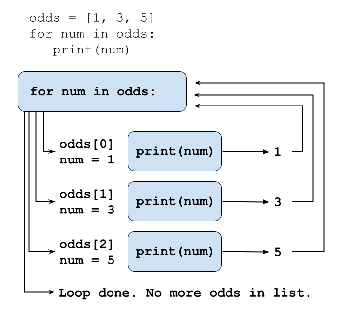

::::::::::::::::::::::::::::::::::::::: objectives

- Explain what `for` loops are normally used for.
- Trace the execution of an un-nested loop and correctly state the values of variables in each iteration.
- Write `for` loops that use the accumulator pattern to aggregate values.

::::::::::::::::::::::::::::::::::::::::::::::::::

:::::::::::::::::::::::::::::::::::::::: questions

- How can I execute Python code iteratively across a collection of values?

::::::::::::::::::::::::::::::::::::::::::::::::::

## For loops

Let's create a short list of numbers in Python, and then attempt to print out each value in the list. 

```python
odds = [1, 3, 5, 7]
```

One way to print each number is to use a `print` statement with the index value for each item in the list:

```python
print(odds[0], odds[1], odds[2], odds[3])
```

```output
1 3 5 7
```

This is a bad approach for three reasons:

1. **Not scalable**. Imagine you need to print a list that has hundreds
  of elements.  

2. **Difficult to maintain**. If we want to add another change -- multiplying each number by 5, for example -- we would have to change the code for every item in the list, which isn't sustainable

3. **Fragile**. Hand-numbering index values for each item in a list is likely to cause errors if we make any mistakes.


```python
odds = [1, 3, 5]
print(odds[0], odds[1], odds[2], odds[3])
```

We get an IndexError when we try to refer to an item in a list that does not exist.

```error
---------------------------------------------------------------------------
IndexError                                Traceback (most recent call last)
<ipython-input-3-7974b6cdaf14> in <module>()
      3 print(odds[1])
      4 print(odds[2])
----> 5 print(odds[3])

IndexError: list index out of range
```

A `for` loop is a better solution:

```python
odds = [1, 3, 5, 7]
for num in odds:
    print(num)
```

```output
1
3
5
7
```

A `for` loop repeats an operation -- in this case, printing -- once for each element it encounters in a collection. The general structure of a loop is:

```python
for variable in collection:
    # do things using variable, such as print
```

We can call the loop variable anything we like, there must be a colon at the end of the line starting the loop, and we must indent anything we want to run inside the loop. Unlike many other programming languages, there is no command to signify the end of the loop body; everything indented after the `for` statement belongs to the loop.

Loops are more robust ways to deal with containers like lists. Even if the values of the `odds` list changes, the loop will still work.

```python
odds.append(9)
odds.append(11)
print(odds)
for num in odds:
    print(num)
```

```output
[1, 3, 5, 7, 9, 11]
1
3
5
7
9
11
```

Using a shorter version of the odds example above, the loop might look like this:

{alt="Loop variable 'num' being assigned the value of each element in the list odds in turn and then being printed"}

Each number (`num`) variable in the `odds` list is looped through and printed one number after another. 

## Loop variables 

Loop variables are created on demand when you define the loop and they will persist after the loop finishes. Like all variable names, it's helpful to give `for` loop variables meaningful names that you'll understand as the code in your loop grows. `for num in odds` is easier to understand than `for kitten in odds`, for example.


## You can loop through other Python objects

You can use a `for` loop to iterate through each element in a string. `for` loops are not limited to operating on lists. 

```python
for letter in 'library of babel':
  print(letter)
```

```output
L
i
b
r
a
r
y
 
o
f
 
B
a
b
e
l
```


## Use `range` to iterate over a sequence of numbers.

The built-in function `range()` produces a sequence of numbers. You can pass a single parameter to identify how many items in the sequence to range over (e.g. `range(5)`) or if you pass two arguments, the first corresponds to the starting point and the second to the end point. The end point works in the same way as Python index values ("up to, but not including").

```python
for number in range(0,3):
    print(number)
```

```output
0
1
2
```

## Accumulators

A common loop pattern is to initialize an *accumulator* variable to zero, an empty string, or an empty list before the loop begins. Then the loop updates the accumulator variable with values from a collection.

We can use the `+=` operator to add a value to `total` in the loop below, so that each time we iterate through the loop we'll add the index value of the `range()` to `total`.

```python
# Sum the first 10 integers.
total = 0

# range(1,11) will give us the numbers 1 through 10
for num in range(1, 11):
    print(f'num is: {num} total is: {total}')
    total += num

print(f'Loop finished. num is: {num} total is: {total}')
```

```output
num is: 1 total is: 0
num is: 2 total is: 1
num is: 3 total is: 3
num is: 4 total is: 6
num is: 5 total is: 10
num is: 6 total is: 15
num is: 7 total is: 21
num is: 8 total is: 28
num is: 9 total is: 36
num is: 10 total is: 45
Loop finished. Num is: 10 total is: 55
```

- The first time through the loop, `total` is equal to 0, and `num` is 1 (the range starts at 1). After those values print out we add 1 to the value of `total` (0), to get 1. 
- The second time through the loop, `total` is equal to 1, and `num` is 2. After those print out we add 2 to the value of `total` (1), to get 3.
- The third time through the loop, `total` is equal to 3, and `num` is 3. After those print out we add 3 to the value of `total` (3), to bring us to 6.
- And so on.
- After the loop is finished the values of `total` and `num` retain the values that were assigned the last time through the loop. So `num` is equal to 10 (the last index value of `range()`) and `total` is equal to 55 (45 + 10). 


:::::::::::::::::::::::::::::::::::::::  challenge

## Loop through a list

Create a list of three vegetables, and then build a `for` loop to print out each vegetable from the list.

Bonus: Create an accumulator variable to print out the index value of each item in the list along with the vegetable name.

:::::::::::::::  solution

## Solution

```python
vegetables = ['lettuce', 'carrots', 'celery']
for veg in vegetables:
    print(veg)
    
```

```output
lettuce
carrots
celery
```
Bonus:

```python
idx = 0
vegetables = ['lettuce', 'carrots', 'celery']
for veg in vegetables:
    print(idx, veg)
    idx += 1
    
```

```output
0 lettuce
1 carrots
2 celery
```


:::::::::::::::::::::::::

::::::::::::::::::::::::::::::::::::::::::::::::::
:::::::::::::::::::::::::::::::::::::::  challenge

## Use range() in a loop

Print out the numbers 10, 11, 12, 13, 14, 15, using range() in a `for` loop.

:::::::::::::::  solution

## Solution

```python

for num in range(10, 16):
    print(num)
    
```

```output
10
11
12
13
14
15
```


:::::::::::::::::::::::::

::::::::::::::::::::::::::::::::::::::::::::::::::

:::::::::::::::::::::::::::::::::::::::  challenge

## Use a string index in a loop

How would you loop through a list with the values 'red', 'green', and 'blue' to create the acronym `rgb`, pulling from the first letters in each string? Print the acronym when the loop is finished.

Hint: Use the `+` operator to concatenate strings together. For example, `lib = 'lib' + 'rary'` will assign the value of 'library' to `lib`.


:::::::::::::::  solution

## Solution

```python
acronym = ''
for color in ['red', 'green', 'blue']:
    acronym = acronym + color[0]
print(acronym)
```

```output
rgb
```

You could also concatenate inside of the loop with `acronym += color[0]`.
:::::::::::::::::::::::::

::::::::::::::::::::::::::::::::::::::::::::::::::

:::::::::::::::::::::::::::::::::::::::  challenge

## Subtract a list of values in a loop

1. Create an accumulator variable called `total` that starts at 100.
2. Create a list called `numbers` with the values of 10, 15, 20, 25, 30.
3. Create a `for` loop to iterate through each item in the list.
4. Each time through the list update the value of `total` to subtract the value of the current list item from `total`. Tip: `-=` works for subtraction in the same way that `+=` works for addition.
5. Print the value of `total` inside of the loop to keep track of its value throughout.


:::::::::::::::  solution

## Solution

```python
total = 100
numbers = [10, 15, 20, 25, 30]
for num in numbers:
    total -= num
    print(total)
```

```output
90
75
55
30
0
```

:::::::::::::::::::::::::

::::::::::::::::::::::::::::::::::::::::::::::::::


:::::::::::::::::::::::::::::::::::::::: keypoints

- A *for loop* executes commands once for each value in a collection.
- The first line of the `for` loop must end with a colon, and the body must be indented.
- Indentation is always meaningful in Python.
- A `for` loop is made up of a collection, a loop variable, and a body.
- Loop variables can be called anything (but it is strongly advised to have a meaningful name to the looping variable).
- The body of a loop can contain many statements.
- Use `range` to iterate over a sequence of numbers.
- The Accumulator pattern turns many values into one.

::::::::::::::::::::::::::::::::::::::::::::::::::


